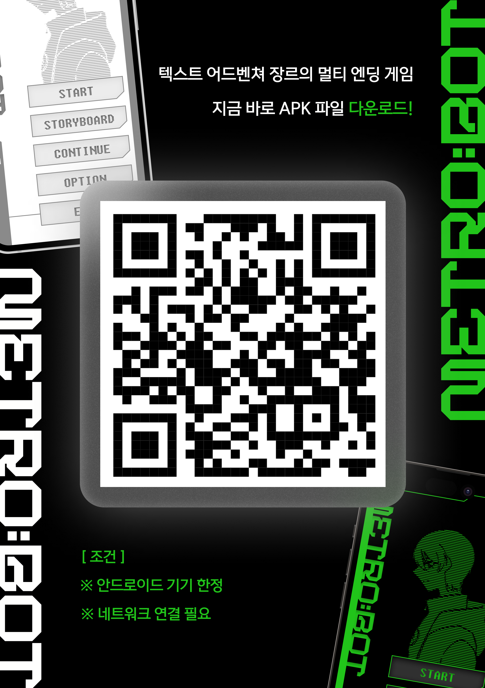

## 작품 및 팀 정보
  | Genre | TEAM | Authors 1 | Authors 2 | Authors 3 | Affiliations | Figma |
  | --- | --- | --- | --- | --- | --- | --- |
  | Game | 전졸시 (전지적 졸업 시점) | 백선희 (게임, 애니메이션 삽화 제작) | 손우혁 (스토리 기획, 게임 개발) | 황애라 (PM, 게임 UX/UI 디자인) | Soongsil University | [METRO:BOT UI Design](https://www.figma.com/design/N2aT2N3sOJcUOOFSsCDPEZ/%EB%94%94%EC%9E%90%EC%9D%B8?node-id=779-232&t=xaIZoRMNblZIWJmT-1) |

<body>
  

  
</body>

 

<!-- Using HTML to center the abstract -->

  

    <h2>INTRO</h2>
    

      2034년, 핵전쟁의 불길이 서울을 삼켰습니다. 폐허가 된 여의도. 살아남은 인간들은 방사능을 피해, 안드로이드들의 힘을 빌려 지하 깊숙이 '쉘터'라 불리는 거대 도시를 구축했습니다. 그로부터 오랜 시간이 흐른 어느 날, 한 안드로이드가 눈을 뜹니다. 기억이라고는 자신을 애타게 부르던 소녀의 모습 뿐. 소녀를 찾아 헤매는 여정이 시작됩니다. 이 모험의 끝에 당신은 어떤 진실과 마주하게 될까요? 텍스트 어드벤처와 도트 그래픽 전투가 어우러진, 선택에 따라 운명이 달라지는 모바일 멀티엔딩 게임. METRO:BOT — 지금 바로 플레이하세요. (QR코드 스캔 / 안드로이드용 / 네트워크 연결 필요)
    

  

 

<!-- Dataset Download Buttons -->

## 게임 소개 
웹소설로 집필 예정이었지만 무산된 작품을 게임으로 되살려보자는 이야기에서 시작된 프로젝트로 주인공 '천일'이 기억을 잃고 유일한 기억인 '소녀'를 찾기 위해 떠나는 여정을 담았습니다. 주인공이 향하는 길목에서 제공되는 선택지에 따라 다양한 엔딩이 기다리고 있으며, 도트 그래픽으로 만든 인게임 삽화와 다양한 전투는 게임을 더욱 몰입감 있게 즐길 수 있습니다.

 

## About Game
### 메인 홈
홈 화면에서 좌측에는 메트로봇 로고와 우측에는 주인공 천일의 모습을 아스키아트로 변환한 이미지가 있습니다.
그리고 컨티뉴, 뉴 게임, 옵션 등 게임 기능을 할 수 있는 버튼들이 배치되어있고, 상단에는 플레이어가 시나리오의 특정 부분으로 바로 넘어갈 수 있도록 검색창을 만들었습니다.

 

### 인게임 삽화, 전투 게임 그리고 다양한 엔딩
- 직접 손수 찍어낸 도트 아트로 게임에 이해도와 몰입감을 높인 도트 아트 (made by. 백선희)
- 당신의 선택에 따라 달라지는 전투 게임 그리고 다양한 엔딩
<body>
  

  

    
    
    
  

</body>

 

## About Animation
### 애니메이션 디자인
주인공 천일과 그의 기억 속 소녀에 대한 잊혀진 진실, 뮤직 애니메이션으로 재탄생! 당신은 그 진실을 마주할 준비가 되었는가?
<body>
  

  
  

</body>
 

 

### 게임 QR 다운로드
🤖 METRO:BOT을 미리 즐기고 싶다면? 지금 다운로드 받으세요! 🤖
> 🌟 안드로이드 기기 한정, 네트워크 연결 필수 🌟
<body>
  

  
</body>
